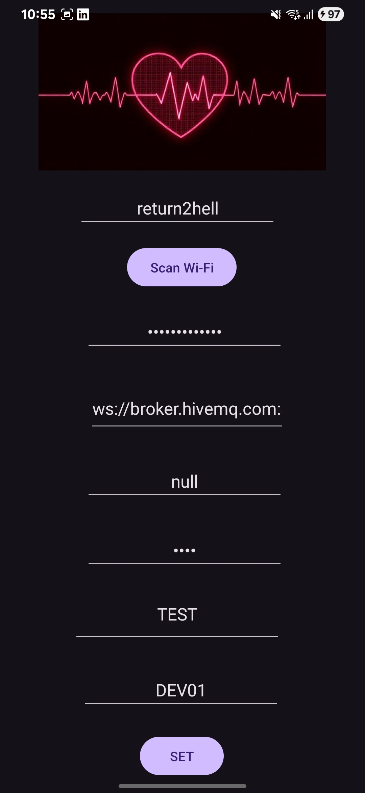

# ConnectHeart

**ConnectHeart** is an Android app designed to configure and communicate with a Wi-Fi-enabled one or more heart monitoring device project [project] (https://github.com/pointertoaperson/sensor_ppg). The app securely saves Wi-Fi and MQTT settings, sends them to the device, and displays heart-related information received from it.

  
  &nbsp;&nbsp;&nbsp;
  

---

## Features

- **Secure Settings Storage**  
  Uses AndroidX EncryptedSharedPreferences to safely store:
  - Wi-Fi SSID and password  
  - MQTT broker address  
  - MQTT username and password  
  - Device ID and group name  

- **Wi-Fi Scan and Selection**  
  Scans for nearby Wi-Fi networks and allows users to select the desired one.

- **MQTT Configuration Sender**  
  Sends settings via HTTP POST to the embedded device (typically hosted at `192.168.4.1`) for device configuration.

- **Heart Data Viewer**  
  Displays real-time heart-related information (e.g., pulse rate, ECG signal, status alerts) from the connected IoT device.

---

## How It Works

1. **Launch the App**
    The app starts with the main screen, which listens to presaved MQTT topics and displays heart-related data from one or more connected devices.

2. **Setting**  
   Tap the *setting* button to set the connection configurations.

3. **Save and Send Settings**  
   Tap the *Set* button to:
   - Store settings securely on the phone.
   - Send a configuration POST request to `http://192.168.4.1/SetConfig`.

---

## Security

 - All sensitive data (Wi-Fi credentials, MQTT username/password) are encrypted using Android Jetpack's [EncryptedSharedPreferences].

 - HTTP (cleartext) is currently used for posting configuration to the ESP8266-based device due to limited processing and memory resources.

 - TLS/HTTPS will be implemented in future versions when migrating to an ESP32, which has sufficient resources to handle secure communication.
 
---

## Requirements

- Android 8.0 (API 26) or higher  
- Location & Wi-Fi permissions enabled  
- Location (GPS) must be on for Wi-Fi scanning  
- ConnectHeart-compatible device in AP mode (`192.168.4.1`) for config  

---

*Umesh Puri*
